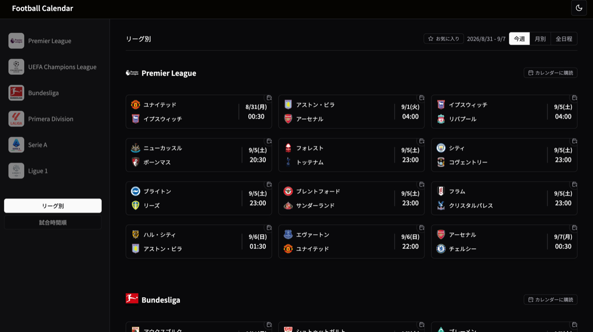

# Football Calendar ⚽️

欧州主要リーグの試合日程を日本語で確認でき、**カレンダーに購読すると日程変更が自動で反映される**アプリです。

**https://football-match-calendar.vercel.app/**



---

## 背景

深夜キックオフの試合を見逃したくない、というのが出発点でした。

日程を一覧で見せるだけなら難しくありませんが、サッカーの日程は変わります。放送の都合でキックオフがずれる、カップ戦の勝ち上がりで相手が決まる、延期になる。「その時点の日程」をカレンダーにコピーしても、いずれ嘘になります。

そこで **iCalendar (ICS) フィードの配信**を軸に据えました。購読しておけば、こちらがデータを更新するだけで購読者のカレンダーが追いつきます。サイトを見に来る必要すらありません。

---

## 主な機能

### 試合日程の表示

- 6リーグ（プレミアリーグ / ラ・リーガ / ブンデスリーガ / セリエA / リーグ・アン / チャンピオンズリーグ）
- **今週 / 月別 / 全日程**の切り替え
- リーグ別・試合時間順の2つのビュー
- 状態はすべてURLに乗るため、共有もブラウザバックも効く

### カレンダー購読（ICS配信）

| URL | 内容 |
| --- | --- |
| `/calendar/premier-league.ics` | リーグ単位 |
| `/calendar/premier-league+bundesliga.ics` | 複数リーグをまとめて |
| `/calendar/teams/57+64.ics` | お気に入りチームだけ |

購読すると、以降の日程変更が自動で反映されます（Googleカレンダーの場合、取り込みタイミングはGoogle側が決めるため最大1日）。

### お気に入りチーム

96チームから選んで、その試合だけに絞り込めます。選択は **localStorage にのみ保存**し、サーバーには送りません。ユーザー登録もDBも不要です。

---

## 技術スタック

- **Next.js 16 (App Router)** / **TypeScript** / **Tailwind CSS**
- **football-data.org**（試合データ・無料プラン）
- **GitHub Actions**（日程の定期取得）
- **Vercel**（ホスティング）

依存パッケージは 17。データベース・認証基盤は使っていません。

Next.js を選んだのは、**サーバーで組み立てたHTMLをそのまま返せる**からです。JavaScriptを実行せずに取得したHTMLに、試合カード70件・日本語のチーム名・キックオフ時刻・購読ボタンがすべて含まれます。クローラーもJS無効の環境も同じものを読めます。

加えて、ICS配信のような「内容が固定でURLが状態を持つ」ものは `generateStaticParams` で静的化してCDNに載せられます。同じフレームワークの中で、動的に返すものと静的に焼くものを使い分けられる点が、この構成に合っていました。

---

## 設計上の判断

### 表示のたびにAPIを叩かない

外部APIは **10リクエスト/分**の制限があります。当初は表示のたびに叩いていたため、1レンダーで13リクエストが飛び、実測で **44リクエスト中20件が429**で失敗していました。

現在は GitHub Actions が1日2回シーズン全日程を取得して `data/snapshot.json` にコミットし、アプリはそれを読むだけです。**実行時のAPI呼び出しはゼロ**になりました。

```
GitHub Actions (1日2回)
  └ APIを取得 → snapshot.json を更新 → コミット → Vercel再デプロイ
                                                      ↓
ユーザーのアクセス ────────────────────→ バンドル済みのJSONから組み立て
```

保存先にDBではなくリポジトリ内のJSONを選んだのは、**git履歴がそのまま「いつ何が変わったか」の記録になる**からです。`git log -p data/snapshot.json` で日程変更を追えます。全リーグのシーズン全日程でも 787KB で、DBを持つ規模ではありません。

### 時刻未定の試合を「未定」として扱う

シーズン全体を扱うと、**大半の試合はまだキックオフ時刻が決まっていません**。

| status | 件数 | 割合 |
| --- | ---: | ---: |
| `SCHEDULED`（日付のみ確定） | 1,196 | 68% |
| `TIMED`（時刻確定） | 501 | 29% |
| `FINISHED` | 55 | 3% |

APIは時刻未定の試合に「マッチデー日付 + 0時UTC」というダミー値を返します。これをそのまま扱うと、JSTでは「9:00キックオフ」という**嘘の時刻**になります。

そのため以下のようにしています。

- 一覧では時刻の代わりに「時刻未定」と表示する
- 日付はJST変換せずUTCの日付を使う（ダミーの0時を換算すると本来のマッチデーとずれるため）
- カレンダーには**終日イベント**として入れる。時刻付きで配ると誤った時刻が購読者のカレンダーに書き込まれてしまう

### 購読フィードは「記録」を必要とする

表示するだけなら Next.js のデータキャッシュで足ります（実際そうしていました）。それでも永続化しているのは、**無人で更新を配り続けるにはシステム自身が「前回と何が違うか」を判断できる必要がある**からです。

しかしキャッシュが持てるのは「APIの最新のレスポンス」だけで、次の2つは持てません。どちらもAPIには存在しない、こちら側で作った状態です。

- 前回配った `SEQUENCE`（同じUIDのイベントを更新するときに増やす番号）
- APIから消えた試合（キャッシュはAPIに追随して消えてしまう）

そこで取得スクリプトが前回のスナップショットと突き合わせ、次のように判断してJSON自身に持たせています。

- キックオフ時刻が変わった / 時刻未定→確定 / 延期・中止 → `SEQUENCE` を上げる
- 試合中・終了への遷移 → **上げない**（毎日更新通知が飛んでしまうため）
- APIから消えた試合 → 黙って消さず `STATUS:CANCELLED` として配り続ける（消すと購読者のカレンダーに古い予定が残るため）

この採番はフィードの正しさを直接左右するため、`node:test` でテストしています（`npm test`）。

### 動的に返すものと静的に焼くものを分ける

ページは `searchParams` を読むため Next.js は Dynamic 扱いにし、`Cache-Control: no-store` を返します。CDNはキャッシュしません。

これは把握した上でそのままにしています。表示範囲やリーグの絞り込みは「同じリソースの別の見え方」であり、パスに移すと同じ内容が複数のURLに出て重複コンテンツになります。実測のTTFBも十分で、URL体系を作り直すコストに見合いません。

一方、購読フィードは**内容がデプロイまで固定で、URLが状態そのもの**です。こちらは静的化に向いているため `generateStaticParams` で事前生成し、`Cache-Control: s-maxage=31536000` でCDNに載せています。購読者が増えてもサーバーは処理しません。

| | TTFB(実測) | |
| --- | ---: | --- |
| `/premier-league` | 0.15〜0.20秒 | 毎回SSR |
| `/`（今週） | 0.27〜0.40秒 | 毎回SSR |
| `/calendar/*.ics` | **0.05秒** | CDNキャッシュ |
| `/?range=all` | 1.3〜1.4秒 | 毎回SSR |

複数リーグの組み合わせは 2<sup>6</sup>-1 = 63通りあるため全部は焼かず、要求されたものだけ生成して以後キャッシュさせています。順序違いのURLが別キャッシュにならないよう、slugは定義順に正規化します。

全日程だけは1,752試合を毎回変換するため1.4秒かかりますが、検索の入口でもなく表示範囲の選択肢のひとつなので、そのままにしています。必要になれば同じ手で事前生成に切り替えられます。

### サーバー描画を捨てずに絞り込む

お気に入りは localStorage にあるためサーバーでは分かりません。かといってクライアントで作り直すと、SSRしたHTMLを捨てることになります。

そこで各カードに `data-team`（2チームのIDを空白区切り）を持たせ、**CSSの属性セレクタで隠す**方式にしました。

```css
[data-match]:not([data-team~="57"]):not([data-team~="64"]) { display: none }
[data-league-section]:not(:has([data-team~="57"], [data-team~="64"])) { display: none }
```

`~=` が空白区切りの値に一致するため2チーム分を1属性で扱え、`:has()` で1試合も残らないリーグは見出しごと消せます。

---

## セットアップ

```bash
npm install
cp .env.local.example .env.local   # FOOTBALL_API_KEY を設定
npm run dev
```

| コマンド | 内容 |
| --- | --- |
| `npm run dev` | 開発サーバー |
| `npm run build` | 本番ビルド |
| `npm test` | SEQUENCE採番とチーム名の検証 |
| `npm run snapshot` | 試合日程を手動で取得・更新 |

環境変数は3つだけです。`FOOTBALL_API_KEY` はスクリプトとGitHub Actionsが使うもので、**アプリの実行時には不要**です。そのため CI では環境変数を一切渡さずに型チェック・lint・テスト・ビルドが通ります（`.github/workflows/ci.yml`）。

---

## 運用メモ

- 試合日程は `.github/workflows/update-snapshot.yml` が 05:00 / 17:00 JST に更新します。差分があるときだけコミットします
- 取得に失敗したリーグは前回のデータを保持します。全上書きにすると、APIが一度失敗しただけで「試合ゼロ」が配信に載ってしまうためです
- チーム名の日本語表記は `data/translations.ts` で管理しています（現在139件）。昇格チームが入ると日本語表記が無いまま英語で表示されるため、**未登録のチームは `npm test` が検知します**。取得スクリプトも警告を出し、GitHub Actions の実行結果に注記として残ります（データ自体は正しいのでコミットは続行します）
- リーグを追加する場合は `data/leagueId.ts` と `scripts/fetch-snapshot.mjs` の両方に定義があります

---

## 既知の制約

- **Googleカレンダーの取り込みは12〜24時間に1回**です。`X-PUBLISHED-TTL` を指定していますがGoogleは参照しません。手動更新の手段もありません
- **チャンピオンズリーグの日程は組み合わせ抽選後**にAPIへ入ります。それまでフィードは0件です
- football-data.org の無料プランは**商用利用不可**のため、非商用の個人プロジェクトとして運用しています

---

Football data provided by the [Football-Data.org API](https://www.football-data.org/)
